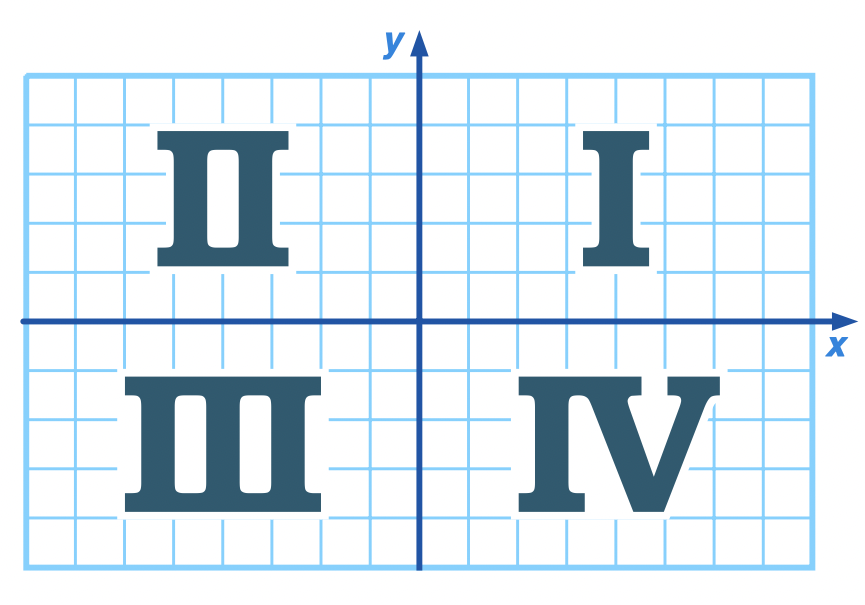

# Question 1

Trois rois, Melik, Casik et Balik, sont assis autour d'une table, débattant qui a le plus grand royaume parmi eux. Chaque roi gouverne un assortiment de provinces, de duchés et de domaines. Collectivement, ils acceptent un système de points qui les aide à juger dont le royaume est le plus grand: chaque domaine vaut 1 point, chaque duché vaut 3 points, et chaque province vaut 6 points. Ils ont juste besoin d'un programme qui leur permettra d'entrer leurs avoirs actuels et de calculer un total de points.

Objectifs:

* Créez un programme qui permet aux utilisateurs de saisir le nombre de provinces, de duchés et de domaines qu'ils ont.
* Additionnez le score total de l’utilisateur, donnant 1 point par domaine, 3 par duché et 6 par province.
* Affichez le total du point à l'utilisateur.


# Question 2

Une grande horloge est endommagé. Les citoyens en ont réparé la majeure partie, sauf une pièce qui nécessite la main d'un programmeur. C'est la pièce qui fait l'horloge faire tick et tock. Si le nombre est pair, le pendule de l'horloge doit faire tick; Si le nombre est impair, le pendule doitfaire tock. Seul un programmeur peut recréer cet élément d'horloge critique pour le faire fonctionner à nouveau.

Objectifs:

* Saisir un nombre comme entrée de la console.
* Affichez le mot «tick» si le numéro est paire. Affichez le mot «tock» si le nombre est impair.
* Astuce: n'oubliez pas que vous pouvez utiliser l'opérateur reste pour déterminer si un nombre est pair ou impair.

# Question 3

Nous devons déterminer la position d'un point dans un plan cartésien.

Le quadrant dans un plan cartésien sont les suivants :



Objectifs:
* Saisir une valeur de x et y de la console.
* Afficher dans quel cadrant la valeur se tient entre I, II, III, IV.

# Question 4

De nombreuses tâches nécessite d'obtenir un numéro d'un utilisateur. Pour gagner du temps, vous avez décidé de faire une méthode pour faire cette tâche commune.
Objectifs:

* Faire une méthode avec la signature `int AskForNumber(string text)`. Affichez le paramètre de texte dans la fenêtre de la console, obtenez une réponse de l'utilisateur, convertissez-la en un `int` et renvoyez-la. 

Exemple: 
```c#
int result = askForNumber ("Quelle est la vitesse de vitesse d'une hirondelle à vide?");.
```

* Faire une méthode avec la signature `int AskForNumberRange(string text, int min, int max)`. Renvoie uniquement si le nombre entré se situe entre les valeurs min et max. Sinon, demandez à nouveau.
* Placez ces méthodes dans au moins un de vos programmes précédents pour l'améliorer.