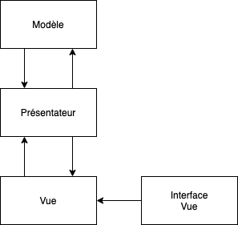
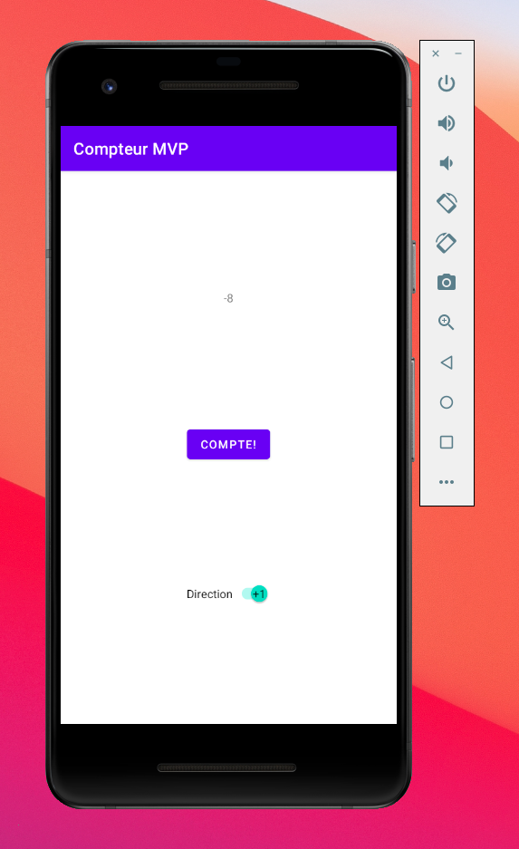
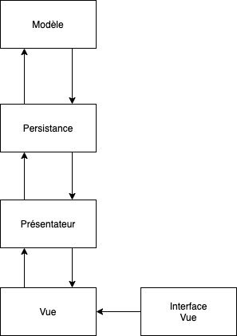

## Architecture d'application

Les applications complexes demandent une architecture qui facilitera la conception des applications. Des patrons d'architecture ont donc été développés pour la conception d'applications complexes. Les patrons permettent d'avoir des structures qui augmentent la lisibilité, la séparation des préoccupations et la testabilité de nos applications.

## Patron MVC

Le patron d'architecture que vous avez surement déjà étudié est le patron MVC.


* Modèle : Contient les structures de données qui représentent les informations de l'application.
* Vue : La représentation de l'interface utilisateur. Dans les applications Android, les activités sont les vues.
* Controlleur : Accepte les manipulations de l'utilisateur et renvoie les informations au modèle. Contient la logique qui permet de mettre à jour la vue.

### Problématique avec le MVC et Android
Avec les activités et les *Listeners* d'Android, et puisque les activités sont liées aux interactions avec l'écran, il arrive rapidement qu'une vue essaie de prendre le rôle du contrôleur. Il devient donc très difficile de tester l'application ou d'avoir une bonne séparation des préoccupations.

## La solution : Patron MVP


* Modèle : Le modèle continue de contenir les structures de données.
* Vue : La vue continue de représenter l'activité, mais communique les actions de l'utilisateur au présentateur.
* Présentateur : Le présentateur est le nouvel élément du patron. Il prend en charge les mises à jour de l'interface utilisateur à partir des informations du modèle, note les actions de l'utilisateur pour envoyer des mises à jour au modèle et gère la logique de l'application.

Ce patron aide à mieux découpler l'architecture d'une application Android. Toute la communication de l'interface va passer à travers le présentateur qui va contenir la logique de notre application. Le modèle continuera de contenir les informations de notre application.

Le patron MVP permet de garder le code spécifique à Android dans la Vue. Le présentateur et le modèle peuvent donc être testés indépendamment de notre application Android.

L'implémentation du code utilisera une interface pour la vue pour augmenter le découplage et faciliter les tests.



## Exemple d'un compteur avec MVP
Voici un lien vers un dépôt d'un compteur avec l'architecture MVP:

LINK HERE

L'application est un simple compteur avec un interrupteur permettant de changer la direction du comptage.




### Modèle

Dans notre application de compteur, nous avons premièrement le `CompteurModele` qui contient le modèle de notre compteur. Deux propriétés y sont situées: le compte courant et la direction du compte (+1 ou -1). Aucune logique n'est présente à l'intérieur du modèle.

### Interface de la vue

L'interface `ICompteurVue` est l'interface que notre Vue devra implémenter pour satisfaire les besoins du présentateur. Il contient toutes les méthodes qui doivent modifier l'affichage de notre application. Dans notre cas, deux méthodes de mise à jour sont requises :

* Affichage de la valeur du compteur 
* Affichage de la direction du compteur

### Vue

La vue est représentée par notre `MainActivity`, elle implémente l'interface `ICompteurVue` qui va nous permettre de faciliter l'utilisation de tests. Le lien entre la vue et le présentateur est établi dans le `onCreate` de l'activité.

```java
    private CompteurPresentateur presentateur;
    ...

    @Override
    protected void onCreate(Bundle savedInstanceState) {
        ...

        presentateur = new CompteurPresentateur(this);

        buttonCompte.setOnClickListener((v -> presentateur.compte()));
        switchDirection.setOnClickListener((v -> presentateur.changerDirection()));
    }
```

On peut voir que la vue a un lien vers notre présentateur et le crée à la création de son activité.

Une deuxième chose à remarquer est que les actions de l'utilisateur sont directement envoyées au présentateur et ne sont reliées à aucune logique dans la vue.

Ensuite, il faut implémenter les méthodes de l'interface `ICompteurVue`:

```java
    @Override
    public void miseAJourCompteur(int compte) {
        textViewCompte.setText(String.valueOf(compte));
    }

    @Override
    public void miseAJourDirection(boolean direction) {
        switchDirection.setChecked(direction);
    }
```

Cette partie va recevoir des informations du présentateur et devra seulement mettre à jour les `View` en conséquence.

### Présentateur

`CompteurPresentateur` va contenir la logique de notre application et le lien entre notre modèle et la vue.

Le constructeur reçoit la vue et crée le modèle qui sera utilisé.

Ensuite, les méthodes sont reliées à des actions qui seront prises par l'utilisateur. Ces méthodes s'appuient sur le modèle pour prendre des décisions. Le modèle est ensuite mis à jour et la nouvelle information est envoyée à la vue.

```java
    public void compte() {
        //Regarde la direction et incrémente/décrémente le compteur
        modele.setCompte(modele.isDirection() ?
                modele.getCompte() + 1 :
                modele.getCompte() -1);
        vue.miseAJourCompteur(modele.getCompte());
    }

    public void changerDirection() {
        //Inverse la direction courante
        modele.setDirection(!modele.isDirection());
        vue.miseAJourDirection(modele.isDirection());
    }
```

## Ajouts possibles au patron MVP
### Intéracteur
Quand notre application commence à avoir beaucoup d'actions et de logique dans le présentateur, il est possible de découpler la logique du présentateur et d'utiliser un intéracteur qui va contenir la logique de notre application et qui viendra se placer entre notre modèle et le présentateur.


### Persistance
Dans l'architecture courante, le modèle est lié directement au présentateur qui est lui-même lié à la vue. C'est un cas problématique dans le cas où la vue doit être détruite, car l'information du modèle sera perdue. Il est donc possible d'ajouter une couche additionnelle de Persistence avant l'accès à notre modèle. Les informations du modèle pourront donc survivre même après la fin de l’activité.

L'utilisation de persistance sera étudiée plus tard dans le cours.

