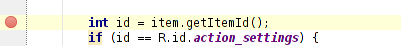
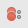
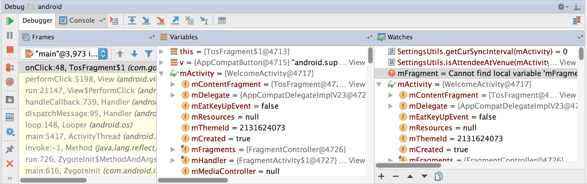

# Principe de débogage 

Le débogage d'un programme est une compétente essentielle de tout bon développeur. Il est important de comprendre les différents outils à notre disposition qui facilitent la vie de développeur.

Le mode "Debug" va nous permettre de controller le flux des instructions de nos différents programmes, d'arrêter aux moments opportuns durant l'exécution et de visualiser les différentes structures de données utilisées.

Nous étudierons les différents outils de débogage qui sont disponibles dans Android Studio.

# Outils de débogage

La majorité des outils de débogage sont disponibles à travers l'exécution de votre application en mode "Debug". 

## Mode "Debug"

Si votre application est déjà en cours d'exécution, vous n'avez pas besoin de l'arrêter pour lancer le mode de débogage. Cliquez simplement sur **Joindre le débogueur au processus Android** . Sinon, démarrez le débogage en cliquant sur **Déboguer** .

## Points d'arrêt

Le point d'arrêt est l'outil principale du mode "Debug". Il permet d'indiquer à notre programme de se mette en attente une fois arrivé à une instruction sélectionnée. Vous pouvez modifier les points d'arrêt à n'importe quel moment, même durant une exécution déjà en cours.

La création des points d'arrêt se fait à l'intérieur du code. Localisez la ligne de code où vous souhaitez suspendre l'exécution, puis cliquez sur la gouttière gauche le long de cette ligne de code ou placez le curseur sur la ligne et appuyez sur Ctrl + F8 (sur Mac, Commande + F8). Attention : le programme s'arrêtera juste avant l'exécution de la ligne sélectionnée.

## Condition d'arrêt et exception d'arrêt

Il est possible de créer des points d'arrêt conditionnels. Imaginons par exemple qu'on souhaite arrêter le programme à la dernière itération d'une boucle. Pour modifier un point d'arrêt, cliquez sur **Afficher les points d'arrêt**  dans l'environnement de débuggage. Depuis cette fenêtre, vous pouvez ajouter, supprimer et configurer les points d'arrêt du programme. Dans la section **Condition** vous pouvez entrer une ligne de code exprimant une condition comme vous le feriez dans un `if`. Le point d'arrêt ne sera alors activé que lorsque la condition sera remplie.

Il est aussi possible de demander l'interruption du programme avant sa fermeture s'il rencontre une exception. Sélectionnez simplement **Exceptions Java** et **Toutes les exceptions** dans le menu de gauche.

## Environnement de déboggage

L'environnement de déboggage apparaît automatiquement au lancement du déboggage ou vous pouvez aller dans Affichage > Fenêtres d'outils > Déboguer. La fenêtre comprendra autant d'onglets qu'il y a de programmes en mode "Debug". Dans l'onglet **Débugueur**, vous trouverez à droite le volet **Cadres** qui montre la série des appels ayant mené au point d'arrêt. Au centre, le volet **Variables** indique toutes les variables et les méthodes présentes dans le cadre de l'appel ainsi que leur valeur. Si une variable contient un tableau, vous pouvez la dérouler pour voir les valeurs qu'elle contient. À droite vous trouverez le volet **Montres**. 

Une fois en mode déboggage, le programme est en attente de savoir comment poursuivre son exécution au-delà du point d'arrêt. Vous avez plusieurs options de commandes :

- Évaluer une expression  : vous pouvez évaluer ici n'importe quelle instruction viable de le cadre de l'arrêt. 
- Exécuter la première ligne de l'appel, ou Pas à pas entrant  : cette action vous mènera à l'intérieur de la méthode appellée.
- Exécuter l'instruction présente et passer à la seconde ligne, ou Pas à pas .
- Sortir du cadre d'exécution présent et remonter d'un niveau d'appel, ou Pas à pas sortant .
- Continuer l'exécution jusqu'au prochain point d'arrêt ou jusqu'à la fin du programme .

## Montres
Une montre est une variable que vous désirez garder à l'oeil en tout temps. Pour ajouter une montre, dans l'environnement de déboggage, cliquez sur **Ajouter** (**+**) dans le volet **Montres**. Vous pouvez aussi faire un clique-droit sur une variable dans le code ou encore dans le volet **Variables** et cliquer sur **Ajouter aux montres**. 

***

Certaines images et traduction sont tirées de la section [Debug](https://developer.android.com/studio/debug) du site d'Android. L'utilisation est conforme à la licence de distribution [Apache V2](http://www.apache.org/licenses/LICENSE-2.0)