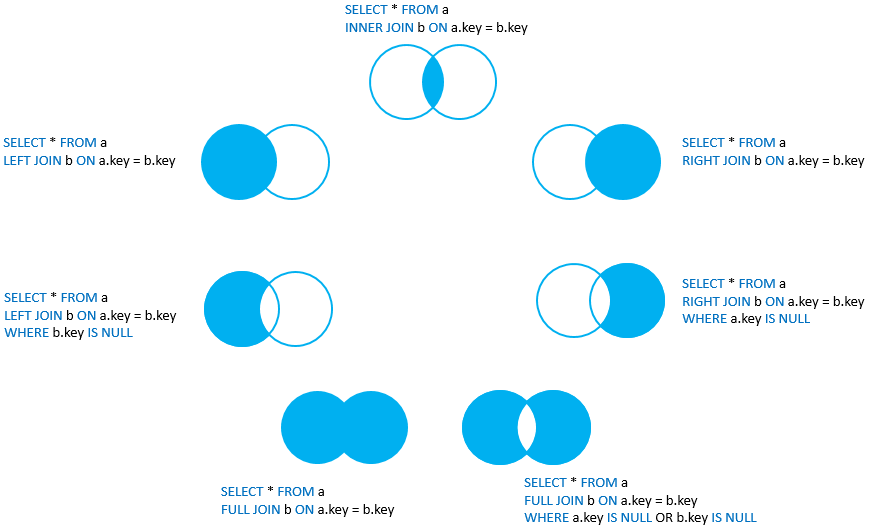
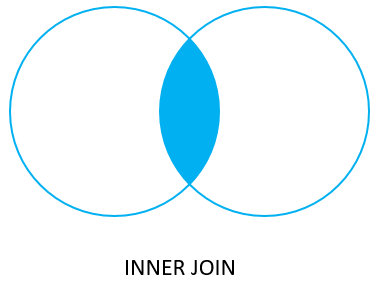
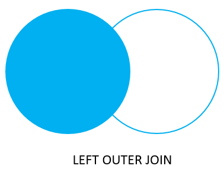
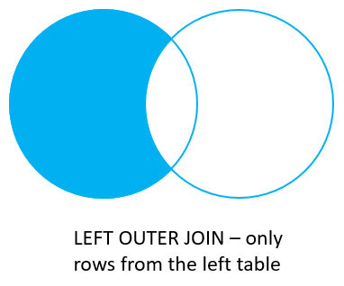
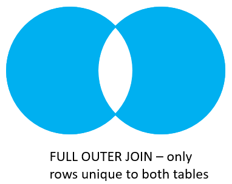

## La sélection avec le `SELECT`

[Référence](https://www.postgresql.org/docs/current/sql-select.html)

Le `SELECT` permet de faire une sélection d'information sur une (et possiblement plusieurs) table. La forme générale du `SELECT` est la suivante :

```sql
SELECT
    expressions
FROM
    table_name;
```

L'évaluation débute avec le `FROM` qui détermine de quelle table on va chercher les informations. Le `SELECT` indique les expressions à aller sélectionner, habituellement des noms de colonnes sont utilisés. Si l'on veut toutes les colonnes d'une table, on remplace les expressions par `*`. Le `;` indique la fin d'une instruction SQL.

Chaque expression peut être délimitée par une virgule et avoir des opérations. À l'intérieur de scripts SQL, les `--` sont utilisé pour les commentaires.

Il est possible de renommer les expressions avec le mot clé `AS`. Cela est utile avec les expressions complexes qui utilisent plus que seulement la colonne.

### Les éléments uniques avec `DISTINCT`

Il est possible de limiter les duplicata avec le mot-clé `DISTINCT`. Celui-ci est rajouté avant les colonnes et va limiter sa sélection à des réponses uniques.

```sql
SELECT
   DISTINCT column1
FROM
   table_name;
```

### Filtrage des informations avec `WHERE`

Par défaut le `SELECT` retournent toutes les lignes d'une table. Le `WHERE` permet de filtrer des lignes d'un `SELECT`.

```sql
SELECT
    expression
FROM
    table_name
WHERE
    condition;
```

La condition est une expression qui sera évaluée pour chaque ligne résultante et qui sera gardé, la condition est vrai. Les conditions peuvent avoir une panoplie d'opérateur :

[Référence](https://www.postgresql.org/docs/14/functions-comparison.html)

| Opérateur | Description |
| -- | -- |
| `=` | égal |
| `>` | plus grand que |
| `<` | plus petit que |
| `>=` | plus grand ou égal |
| `<=` | plus petit ou égal |
| `<>` ou `!=` | différent de |
| AND | opération logique ET |
| OR | opération logique OU |
| IN | Retroune vrai si la valeur est incluse dans la liste donnée |
| BETWEEN | Retourve vrai si la valeur est entre les bornes |
| LIKE | Retourne vrai si la valeur répond au pattern |
| IS NULL | Retourne vrai si la valeur est NULL |
| NOT | Inverse le résultat logique du reste des opérations |

#### Motif (pattern matching) avec `LIKE`

L'opération `LIKE` est spéciale car elle tente de faire la détection d'un motif (pattern) dans une chaine. Deux caractère sont spéciaux : le tire-bas `_` remplace un caractère simple et le poucentage `%` remplace une séquence de zéro à une infinité de caractères.

```sql
'abc' LIKE 'abc'    -- true
'abc' LIKE 'a%'     -- true
'abc' LIKE '_b_'    -- true
'abc' LIKE 'c'      -- false
```

### Trie de résultat par le `ORDER BY`

Il est possible de trier les résultats avant l'affichage avec un `ORDER BY`. Il est ensuite possible de donné la liste des colonnes qui sera utilisé pour le trie. Les colonnes peuvent avoir l'ajout `DESC` si on veut un tri inverse.

```sql
SELECT
	select_list
FROM
	table_name
ORDER BY
	sort_expression1 [ASC | DESC],
        ...
	sort_expressionN [ASC | DESC];
```

### Fonctions d'agrégation

[Référence](https://www.postgresql.org/docs/9.5/functions-aggregate.html)

Il existe des fonctions permettant de faire l'agrégation d'information sur toutes les lignes d'une table. Les fonctions suivantes peuvent être utilisées comme expression sur une table. 

| Fonction | Description |
| -- | -- |
| avg(column) | Moyenne des valeurs |
| count(column) | Décompte du nombre de ligne |
| min(column), max(column) | Trouve la valeur min/max des lignes |
| sum(column) | La somme des valeurs des lignes |

Les fonctions d'agrégats transforment le résultat final et ne sont pas utilisables avec des expressions d'autres colonnes qui ne sont pas des fonctions d'agrégats.

## Regroupement de données avec le `GROUP BY`

En suite aux fonctions d'agrégation, il est possible de regrouper des données avant d'appliquer la fonction d'agrégation sur les sous-groupes. La commande `GROUP BY` nous permet de regrouper des sous-ensembles et d'avoir la réponse de chaque regroupement.

```sql
SELECT
    select_list (aggregates)
FROM
    table_name
GROUP BY
    column;
```

La liste de sélection peut donc avoir les colonnes des regroupements ou des fonctions d'agrégation, mais pas d'autre expression.

## Les jointures de tables

Avec les relations établies avec les clés étrangères, il est souvent souhaitable de "combiner" les données de plusieurs tables ensemble. Dans les bases de données, cela se nomme des jointures de tables.

Pour faire les jointures, nous indiquerons dans nos instructions SQL la colonne qui sera utilisée pour faire la jointure.

Il existe plusieurs types de jointures en fonction de ce que tu recherches. Les jointures possibles sont :

* inner join
* left join
* right join
* full outer join
* cross join



Dans le cadre du cours, nous étudierons le inner join, left/right join et le full outer join.

### Inner join



Le inner join est la jointure la plus commune qui nous permet de rejoindre les informations communes entre deux tables.

```sql
SELECT
    *
FROM
    table1
INNER JOIN
    table2 ON table1.id_common = table2.id_common;
```

### Left/Right join




La jointure gauche/droite permet d'avoir tous les éléments d'une table avec des informations possiblement vides d'une deuxième table. Il est aussi possible d'avoir une "soustraction" pour avoir seulement les éléments d'une première table ne se retrouvant pas dans une deuxième table.

```sql
SELECT
    *
FROM
    table1
LEFT OUTER JOIN 
    table2 ON table1.id_common = table2.id_common;
WHERE -- On ajoute le WHERE si on veut soustraire de la table 1 
    table2.column is null;
```

### Full outer join




La jointure pleine permet d'avoir toutes les lignes des deux tables avec des éléments possiblement NULL quand il n'y a pas eu de corrélation. Il est aussi possible d'avoir seulement les éléments uniques à chaque table.

```sql
SELECT
    *
FROM
    table1
FULL JOIN 
    table2 ON table1.id_common = t2.id_common
WHERE -- On ajoute le WHERE si on veut soustraire des deux tables
    table1.column is null or table2.column is null;
```