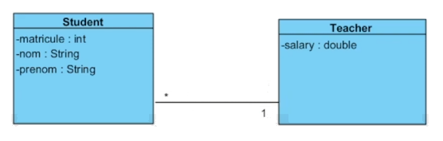
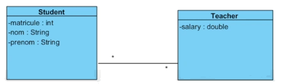

## Fonctions
* Les fonctions sont des séries d'instructions contenues dans un ensemble pouvant être facilement re-utilisé. Par convention, la fonction doit faire une tâche simple et précise;
* Contrairement aux scripts, les fonctions n'auront pas de saisit avec `input` et pas d'affichage avec `print`. Cela à moins d'être expressément demandé.
* Les fonctions peuvent demander des paramètres (ou arguments) d'entrées. Ce sont des informations préalables aux calculs de la fonction;
* Les fonctions peuvent émettre des réponses que l'on appelle retour.

## Présentation d'une fonction minimale
~~~python
def nomFonction():
    instructions

~~~

* Une fonction est au début du fichier;
* La fonction peut ensuite être appelée par son nom d'autres programmes.

## Paramètres d'entrées
* Une fonction peut demander des paramètres d'entrées;
* Ceux-ci seront dans une liste après le nom de la fonction entre parenthèses délimitée par une virgule;
* Les paramètres d'entrées seront fournis par l'appelant de la fonction et peuvent donc être utilisés à l'intérieur des instructions de la fonction sans être assignés préalablement.

~~~python
def fcnAvecIn(var1, var2):
    print(var1 * var2)

~~~

## Retours
* La fonction peut retourner un résultat qui sera utilisable par l'appelant de la fonction.
* Le mot-clé `return` est utilisé quand l'expression de retour est prête à être renvoyée.
* Une fonction qui ne contient pas de retour est aussi nommée une procédure.

~~~python
def fcnAvecRetour():
    instructions
    return expression
~~~

## Exemple 1
* Écrivez une fonction qui trouve l’aire d’un triangle à partir de sa base et sa hauteur.

~~~python
def aireTriangle(base, hauteur):
    return base * hauteur / 2

# Utilisation de la fonction dans un programme
aire = aireTriangle(3,4)

if aire > 10:
    print('super')
else:
    print('booooo')
~~~

* Écrivez une fonction qui détermine si un nombre est impair.

~~~python
def estImpair(nombre):
    if nombre % 2 == 1:
        return True
    else:
        return False

def estImpairEfficace(nombre):
    return nombre % 2 == 1

print(estImpair((1564)))
~~~

## Présentation de l'en-tête d'une fonction
~~~python
def nomFonction(arg1, arg2):
"""
Description générale de la fonction
Args:
  arg1 (float) - Description de l'arg1
  arg2 (bool) - Description de l'arg2
Returns:
  float: Description de retour1
Example:
  >> nomFonction(4,6)
      34
"""
    instructions
~~~

## Contexte et durée de vies des variables
* Tout ce qui se passe à l'intérieur des fonctions est détruit après l'appel de la fonction;
* Toute déclaration de variables à l'intérieur d'une fonction est détruite après l'appel de la fonction;
* Seule la valeur de retour est renvoyée.

## Passage par valeurs
* Les paramètres et les retours sont renommés pour la durée de la fonction. Les noms des paramètres de la fonction se nomment paramètres formels;
* Seules leurs valeurs seront transférées entre la fonction et l'appelant. On utilise le terme paramètres effectifs;
* Les noms des paramètres et des retours n'ont aucune incidence;
* L'ordre des paramètres et des retours est ce qui sera considéré.

## Exemple 2
* Quel est le résultat de l'affichage du script `passageParValeurTest.py`

~~~python
# passageParValeurTest.py
def  passageParValeur(x, y):
    x = x + 2
    y = y - 2
    z = x - y + 2
    return z

x = 4
z = 8
y = 6
x = passageParValeur(y,x)
print('La valeur de x,y et z sont :', x, y, z)
~~~

# Conversion des diagrammes de classe UML à des diagrammes d'entité relations (ERD)

La conversion d'un diagramme de classe en ERD se fait en 3 étapes:

1. Transformation des classes en entités.
2. Ajout ou identification de clé primaires
3. Transformation des associations

## 1 - Transformation des classes en entités

Les classes se transforment en entités et les types se transforment pour être conformes au type de donnée qui sera disponible avec la base de données utilisée. Les propriétés sont réduites à la liste suivante :

* Nullable
* Unique

Si un des attributs avait une multiplicité (une liste de valeurs), celle-ci devient sa propre entité qui aura une association avec l'entité initiale.

## 2 - Ajout ou l'identification de la clé primaire

Une clé primaire doit être identifiée pour chacune des entités du ERD. Deux possibilités sont disponibles :

* Si une information identifie uniquement chacune des instances de l'entité, celle-ci est désignée comme clé primaire (on la nomme clé primaire naturelle).
* Si aucune information est identifiante, un nouvel attribut est ajouté pour représenter la clé primaire (nommé clé primaire artificielle).

## 3 - Transformation des associations
Les ERD ne peuvent que traiter deux types d'association :

* 1 - 1 ou 0 - 1
* 1 - n ou 0 - n

Si les associations sont d'une autre multiplicité, elles seront normalisées à celles-ci. Dans les cas où nous avons une relation n-m, une conversion additionnelle sera nécessaire.

### Exemple de transformation de 1-n

### Ajout de clé étrangère

Dans les associations, nous devons ajouter une clé étrangère pour que la base de données puisse faire le lien avec l'association représentée.

### Transformation n-m

Pour des associations n-m, il faut ajouter une table de jointure qui va s'insérer entre les deux tables de la relation n-m avec une relation 1-n entre chacune. La table de jointure va contenir des clés étrangères des deux autres tables.

Dans le cas d'une classe d'association, c'est le même principe avec des attributs additionnels.

### Exemple de transformation de n-m

